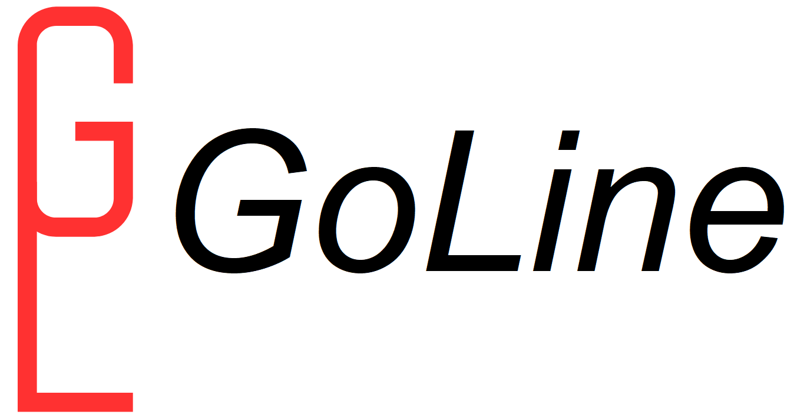

#  GoLine
GoLine is a lightweight task queue system written in Go, backed by Redis.

It provides a simple way to enqueue tasks via HTTP and process them asynchronously with workers. The focus is on clarity, minimalism, and explicit control over execution.

---

## Features

* Healthcheck endpoint
* Create and enqueue tasks
* Redis-backed queue using lists
* API for consumer workers, including completion acknnowledgement API
* DLQ API
* Middleware for logging and error handling

---

## Next Steps

* Create GET endpoint to inspect list
* Add persistence or retry policies
* Add OpenAPI/Swagger
* Unit and integration tests

---

## Project Structure

```
/cmd/api/main.go        # entrypoint (wiring, dependencies)
/internal/http/         # routing + middleware
/internal/tasks/        # domain logic (handler + service)
/provider               # external-facing components for queue consumer
```

---

## Requirements

* Go 1.20+
* Redis running locally (default: `localhost:6379`)

---

## Setup

Clone the repo and initialize dependencies:

```bash
go mod tidy
```

Run Redis (if not already running):

```bash
redis-server
```

Start the API:

```bash
go run cmd/api/main.go
```

Server runs on:

```
http://localhost:8080
```

To see how a consumer is expected to feed on the queue, check *example_consumer.go*.

---

## Endpoints

### Healthcheck

```
GET /api/health
```

Response:

```json
{ "status": "ok" }
```

---

### Create Queue

```
POST /api/queue
```

Body:

```json
{
  "name": "queue1"
}
```

Response:

```json
{
  "queue": "queue1",
  "status": "CREATED"
}
```

---

### Create Task on Queue

```
POST /api/queue/task
```

Body:

```json
{
  "queue": "queue1",
  "function": "some_function",
  "params": {"example_parameter": "abc"}
}
```

Response:

```json
{
  "id": "8f249d8c-b6d0-4356-b894-3da3d193c2df",
  "queue": "queue1",
  "status": "ENQUEUED"
}
```
* Note: There is **no implicit "create queue" step**.

  Queues are created only using the POST /api/queue endpoint. Creating a tasks for an non existent queue will return an error.

---

## Consumer

Package `provider` exposes the primitives required to build a consumer.

It defines:

- `Task`: representation of a task as stored in Redis
- `Provider`: handles task consumption and acknowledgment
- `DLQItem`: represents a failed task, either as a parsed `Task` or raw payload

- __NewProvider__ _(rdb *redis.Client, queue string)_: Creates and returns a Provider address.

Methods of the provider:

- __Next__ _(ctx context.Context)_: Pops a task from the queue of the provider and sets it as "processing". Returns a Task object, a []string with raw data, and any error.

- __Ack__ _(ctx context.Context, id string)_: Unsets a task as processing, identifying by id. Returns any error.

- __SendToDLQ__ _(ctx context.Context, key string, item DLQItem)_: Stores a DLQItem in a queue.

To see these components in action, please refer to `example_consumer.go`.

## Redis Data Model

Queues are implemented using Redis **lists**.

* Key → queue name
* Value → list of tasks

Inspect:

```bash
LRANGE queue:queue1 0 -1
```

---

## Design Notes

This project follows a simple layered design:

```
HTTP (Gin)
   ↓
Handler (request/response)
   ↓
Service (business logic)
   ↓
Redis (storage)
```

### Why this matters

* Handlers stay thin and testable
* Business logic is isolated from HTTP
* Easy to extend with new endpoints

---

## FAQ

### Why no database?

Redis is used directly as a queue for simplicity.

### Why separate handler and service?

To avoid mixing HTTP concerns with business logic and to make the code easier to scale and test.

### Is AI being used to develop GoLine?

ChatGPT is being used to help with documentation and comments, but no code in this repo was written with AI.

---
